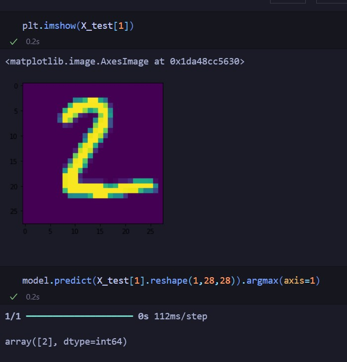

<h1>Handwritten Digit Recognizer using ANN</h1>

<h2>Overview</h2>

This project implements a Handwritten Digit Recognizer using an Artificial Neural Network (ANN). The model is trained on the MNIST dataset, which consists of 28x28 pixel grayscale images of handwritten digits (0-9). The goal is to accurately classify each digit in the dataset.

<h2>Features</h2>
Preprocessing of the MNIST dataset. 
Building and training a neural network from scratch. 
Evaluating the model's performance. 
Visualizing the results. 
Installation 

<h4>Clone the repository:</h4>

<h6>bash</h6> 
Copy code
git clone https://github.com/Pawon25/Hand-Written-Digits-Recognition-Using-ANN.git  
cd handwritten-digit-recognizer
Create and activate a virtual environment (optional but recommended):

<h6>bash</h6>
Copy code 
python -m venv venv
source venv/bin/activate   # On Windows use `venv\Scripts\activate`

<h6>bash</h6>
Copy code 
pip install tensorflow  
For installing tensorflow library

<h3>Data Set</h3>
The MNIST dataset is used in this project. It can be automatically downloaded using the TensorFlow/Keras library. For more information about the dataset, visit the MNIST Database.

<h3>Model Architecture</h3>
The neural network model consists of the following layers:

Input layer: Flatten() to convert 28x28 images into 1D vectors of 784 elements. 
Hidden layer 1: Dense(128, activation='relu') with 128 neurons and ReLU activation. 
Hidden layer 2: Dense(32, activation='relu') with 32 neurons and ReLU activation. 
Output layer: Dense(10, activation='softmax') with 10 neurons and softmax activation.

<h2>Results</h2>

The model achieves an accuracy of approximately 98% on the test dataset. Further improvements can be made by experimenting with different architectures, optimizers, and hyperparameters.

